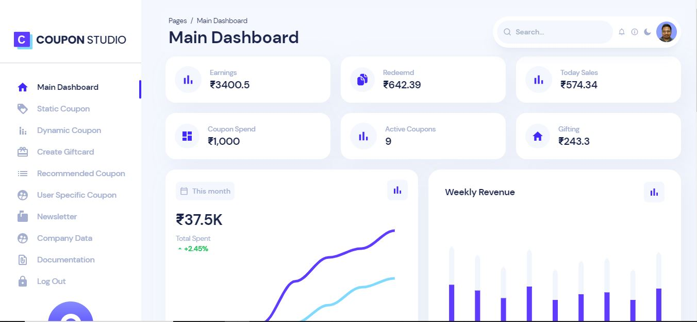

<h1 align="center">
  🎉💰 COUPON STUDIO 💸🎁
</h1>

<p align="center"> 💰Boost your business with our MERN stack coupon generator platform that allows you to create, manage, and distribute personalized coupons to your customers easily and efficiently!🎉</p>

<p align="center"><a href="https://reactjs.org/" target="_blank"></a>&nbsp;<a href="https://nextjs.org/" target="_blank"></a>&nbsp;<a href="https://www.mongodb.com/" target="_blank"></a>&nbsp;<a href="https://nodejs.org/" target="_blank"></a></p>

## Problem Statement 🤔

A promotion engine is a software system that automates the process of creating and managing promotional campaigns for businesses. In the real world, a promotion engine typically works by analyzing customer data and behavior to create targeted promotions and offers. The challenge for this hackathon is to develop a coupon generator platform that allows businesses of all sizes to create and distribute coupons easily and efficiently.

## Solution 💡

Our solution is a web application that allows businesses to create and distribute coupons to their customers. The application consists of the following modules:

- 🚀 User authentication: users can sign up for an account using their email and password, or they can sign in using their Google or Facebook accounts. Once users are authenticated, they can create, edit and delete coupons.
- 🎫 Coupon management: businesses can create and manage their own coupons, with options to set expiration dates, discount amounts, and product or category restrictions.
- 💌 Coupon distribution: businesses can distribute their coupons to their customers via email, social media, or other channels.

## 🎉 Features

Our coupon generator platform is packed with features that make it easy and efficient for businesses to create and distribute personalized coupons to their customers. Here are some of the key features of our platform:

### User Authentication

Our platform includes a user authentication system that allows users to sign up for an account using their email and password, or they can sign in using their Google or Facebook accounts. Once users are authenticated, they can create, edit, and delete coupons.

### Coupon Management

Businesses can create and manage their own coupons on our platform. Our platform allows businesses to set expiration dates, discount amounts, and product or category restrictions. Businesses can also view and edit their existing coupons.

### Coupon Distribution

Businesses can distribute their coupons to their customers via email, social media, or other channels. Our platform provides businesses with tools to easily distribute their coupons to their customers.

### Personalized Coupons

Our platform allows businesses to create personalized coupons for their customers based on their purchase history and preferences. This allows businesses to create targeted promotions and offers for their customers.

### Real-time Analytics

Our platform provides real-time analytics to businesses on the performance of their coupons. Businesses can track the number of coupons distributed, redeemed, and the revenue generated from their coupons.

### Integration with Third-Party Services

Our platform integrates with third-party services such as Google Analytics and Facebook Pixel to provide businesses with more insights on the performance of their coupons.

## Demonstration

<br />

**Dashboard**

<p align="left">
  
</p>
<br />

**Register & Login**
<br />

<p align="left">
  
</p>

<br />


**Static Coupon Generation**

<br>


<br />

**Dynamic Coupon**


<br />

**Create Giftcard**


<br />


**Recommended Coupons**


  
<br />

**User Specific Coupon**


<br />

**Newsletter**


<br />

**Company Data**


<br />

**Documentation**


<br />

## Technologies Used 🛠️

- MongoDB 🍃
- Express.js 🚂
- React ⚛️
- Node.js 🧑‍💻
- Redux 🔄
- Bootstrap 🥾
- Passport.js 🛡️
- JSON Web Tokens 🔐
- Nodemailer 📧

## ⚡️ Quick start

**Local Setup || Project Structure**

- The project contains 4 broad directories.

```
*
├───client
├───Discount-Prediction-model
├───server
└───Chrome-Extension
```

- `client`: The frontend for the application.
- `Discount-Prediction-model`:  The neccessare api for predicting discount.
- `server`: The backend for the application.
- `Chrome-Extension`: The neccessare api for analysing resume.
<br />

First of all clone the repository to your local machine.

```sh
git clone https://github.com/priyanshpsalian/SMART-COUPON
```
**Client**

For local setup of frontend:

- `cd client`
- `npm i`
- `npm start`
- Go to `localhost:3000`

Structure

```
src
├───assets
├───components
├───containers
└───index.js
```

Individual Component & Container Structure

```
component
├───component.jsx
└───component.css
```

**Chrome-Extension**

For local setup:

- `cd Chrome-Extension`
- `npm i`
- `npm start`
- Go to `localhost:3002`

**Server**

For local setup of backend:

- `cd server`
- `npm i`
- `npm start`
- Go to `localhost:3001`

```
server
├───controllers
├───middlewares
├───models
├───routes
└───package.json
```

**Discount-Prediction-model**

The complete setup can be found in the [`Discount-Prediction-model` directory](./Discount-Prediction-model).


That's all you need to know to start! 🎉


## Usage 🚀

To use the application, follow these steps:

1. Sign up for an account or log in with your Google or Facebook account.
2. Create a coupon by filling out the form on the "Create Coupon" page.
3. View and manage your coupons on the "My Coupons" page.
4. Distribute your coupons to your customers via email, social media, or other channels.


## Contributing 🤝

Contributions are welcome! Please create a pull request and we will review it as soon as possible.

## License 📝

This project is licensed under the [MIT License](https://opensource.org/licenses/MIT).


